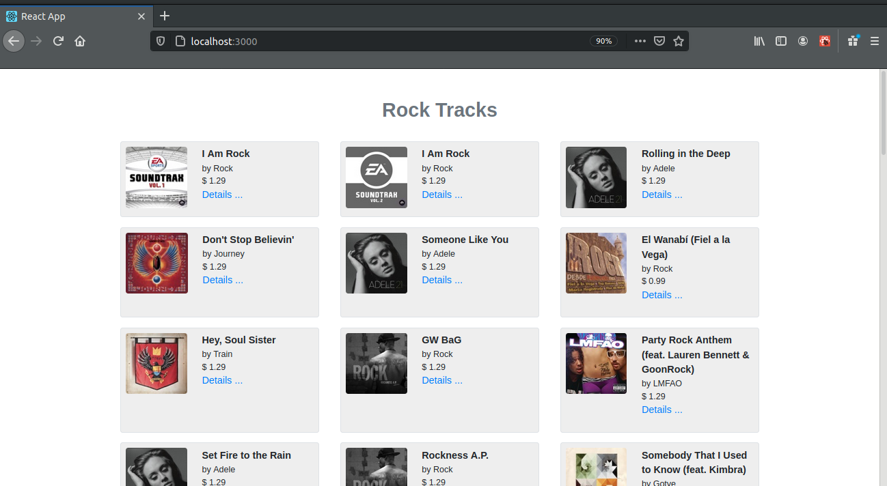
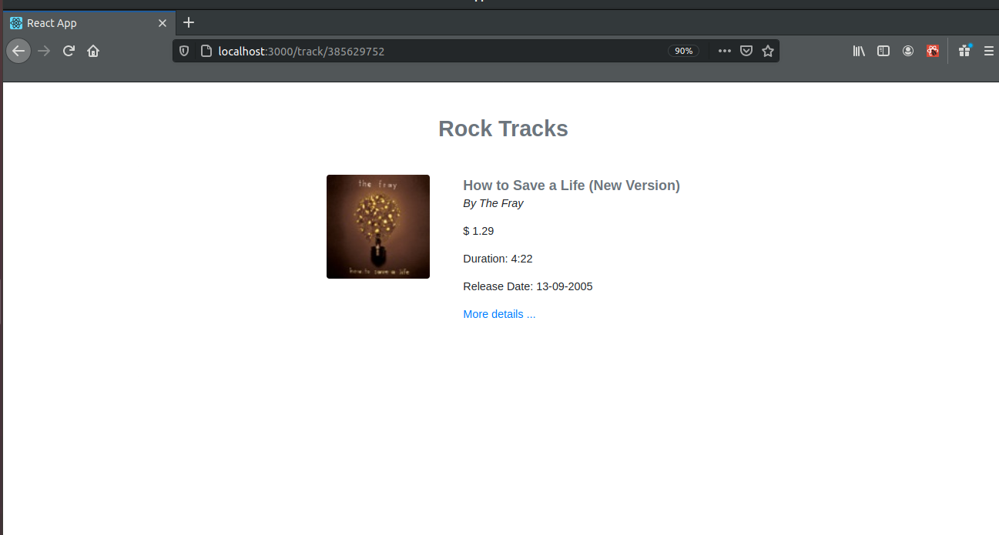

# Img-view app

## Overview

This is a React/Redux SPA application that connects to an [Apple REST web service](https://itunes.apple.com/search?term=rock&media=music) and returns a list of rock tracks. It consists of two screens: Tracks tracks screen with 50 images and page for the specific image selected by
clicking a ‘Details’ button on Landing page.

## Running The Project

From the repo:

1. Clone this repo into your local machine.
2. Run `cd img-view` in your bash/command line
3. Run `npm install` in your bash/command line.
4. Run `npm start` in your bash/command line.
5. Open [http://localhost:3000](http://localhost:3000) to view it in the browser.
6. `npm test` to run tests

## Tech Used / Dependencies

- This project was bootstrapped with [Create React App](https://github.com/facebook/create-react-app).
- Functional component with react hooks were used to create views.
- State management:  
  When Landing page loads it makes api call to fetch a list of images and the associated metadata. This data is stored in context to prevent from making api calls every time when user returns from individual image page.  
  Second page gets data about the image from lading page through props, if there is no props this component will make api call and get data for a specific image by id. In this case id is received from page url using `useParams` hook 
  Alternative options: Lift up state to parent component or redux.
- React router was used to create two routes
- `React.PropTypes` package to run typechecking on the props for components
- [Prettier](https://www.npmjs.com/package/prettier) to format code.
- Bootstrap

## Improvement

1. Add more tests
2. Use async/await syntax
3. Improve folder structure
4. Axios instead of Fetch

## App Preview

Tracks (screen 1)  

Detailed view of the selected track (screen 2) 

